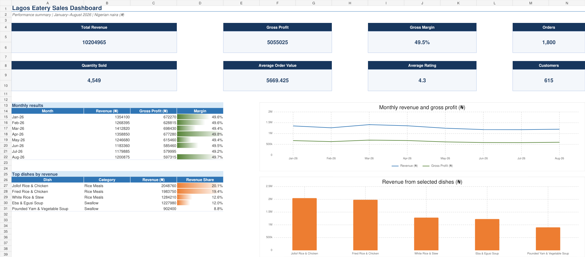

# Lagos Eatery Sales and Profitability Analysis



## Project overview

This portfolio project analyzes eight months of synthetic transaction data for a small Lagos eatery. It converts detailed sales records into an Excel dashboard that helps management understand revenue, menu demand, customer activity, and gross profitability.

> **Important:** The dataset is synthetic and was created for learning and portfolio demonstration. It does not represent the records of an actual business.

## Business problem

The eatery records daily sales but lacks a centralized reporting system that clearly shows:

- which dishes generate the most revenue and gross profit;
- whether sales and margins are improving or declining;
- how customer demand changes by month, meal period, and sales channel;
- whether menu pricing sufficiently covers direct food costs; and
- where management should focus purchasing, promotions, and operational resources.

Without a structured analysis, management may overstock slow-selling ingredients, understock popular meals, apply poorly targeted discounts, or mistake gross profit for final business profit.

## Project objective

Build an Excel-based sales and profitability dashboard that transforms transaction data into clear KPIs and actionable insights for menu planning, pricing, inventory purchasing, customer service, and operational decision-making.

## Business questions

1. How much revenue and gross profit did the eatery generate?
2. What is the overall gross margin?
3. Which dishes produce the most revenue, profit, and sales volume?
4. How does performance change from month to month?
5. What is the average order value and customer rating?
6. How many orders and unique customers were served?
7. Which findings should influence pricing, promotions, and inventory planning?

## Hypotheses

| ID | Hypothesis | Measure used | Result |
|---|---|---|---|
| H1 | Rice meals account for the largest share of revenue. | Revenue grouped by menu category | Supported: the three leading dishes are rice meals. |
| H2 | Jollof Rice and Chicken is the highest-revenue dish. | Revenue grouped by dish | Supported: approximately ₦2.05 million, or 20.1% of revenue. |
| H3 | The eatery maintains a gross margin of at least 45%. | Gross profit divided by revenue | Supported: overall gross margin is approximately 49.5%. |
| H4 | Monthly revenue shows consistent growth throughout the period. | Month-over-month revenue trend | Not supported: revenue peaked in March and generally declined afterward. |
| H5 | Customer satisfaction is strong, with an average rating of at least 4.0/5. | Mean of submitted ratings | Supported: average rating is approximately 4.3/5. |

These results describe the generated sample and should be retested using real operational data before business decisions are made.

## Key results

| KPI | Result |
|---|---:|
| Total revenue | ₦10,204,965 |
| Gross profit | ₦5,055,025 |
| Gross margin | 49.5% |
| Orders | 1,800 |
| Quantity sold | 4,549 |
| Average order value | ₦5,669 |
| Unique customers | 615 |
| Average submitted rating | 4.3/5 |

### Main findings

- Jollof Rice and Chicken generated approximately **₦2.05 million**, representing **20.1%** of total revenue.
- Fried Rice and Chicken generated approximately **₦1.98 million**, representing **19.4%** of total revenue.
- The two leading dishes contributed almost **40% of total revenue**, indicating meaningful product concentration.
- March produced the highest monthly revenue, approximately **₦1.41 million**.
- Monthly revenue generally softened after March, reaching its lowest point in July at approximately **₦1.18 million**.
- Gross margin remained stable at approximately **49%–50%**, suggesting that direct food costs were controlled consistently in the simulated data.
- The average submitted rating of **4.3/5** indicates generally positive customer satisfaction.

## Methodology

### 1. Data generation

A reproducible synthetic dataset was generated for January–August 2026. It contains 1,800 transaction lines and 12 menu items across Rice Meals, Traditional Meals, Swallow, Sides, and Beverages. The generated fields include dates, customers, dishes, quantities, prices, discounts, unit costs, sales channels, payment methods, meal periods, hours, and ratings.

### 2. Data preparation

- Assigned consistent order and customer identifiers.
- Stored dates as valid Excel dates.
- Standardized categorical fields such as order channel and payment method.
- Preserved blank ratings where feedback was not submitted.
- Separated raw fields from calculated financial fields.
- Applied filterable Excel tables for exploration and quality review.

### 3. Calculated metrics

The processed dataset adds the following calculated fields:

```text
Revenue = Quantity × Unit Price × (1 − Discount Rate)
Total Cost = Quantity × Unit Cost
Gross Profit = Revenue − Total Cost
Gross Margin = Gross Profit ÷ Revenue
Average Order Value = Total Revenue ÷ Number of Orders
```

The workbook uses Excel formulas including `SUM`, `SUMIFS`, `COUNTIFS`, `COUNTA`, `AVERAGE`, `IF`, and `IFERROR`-style controls for aggregation and exception handling.

### 4. Analysis

- Aggregated revenue, total cost, gross profit, quantity, orders, and ratings by month.
- Aggregated revenue, profit, quantity, revenue share, and margin by dish.
- Ranked dishes by revenue.
- Compared monthly revenue and gross profit trends.
- Monitored customer activity and satisfaction through unique-customer and rating KPIs.

### 5. Visualization

The Excel dashboard presents:

- eight KPI cards;
- a monthly results table;
- a top-dish ranking table;
- a monthly revenue and gross-profit line chart; and
- a revenue-by-dish bar chart.

Conditional formatting highlights gross margins, revenue shares, and customer ratings.

### 6. Validation

- Reconciled dashboard totals to the processed transaction table.
- Checked copied formulas across the first, middle, and final records.
- Scanned the workbook for common formula errors.
- Reviewed all worksheets visually for clipping, unreadable labels, broken charts, and overlapping content.

More detail is available in [docs/methodology.md](docs/methodology.md), and field definitions are in [docs/data_dictionary.md](docs/data_dictionary.md).

## Recommendations

1. Protect availability of ingredients required for Jollof Rice and Chicken and Fried Rice and Chicken because these products generate nearly 40% of revenue.
2. Bundle leading dishes with drinks or sides to raise average order value.
3. Investigate the decline after March by comparing operating days, stockouts, promotions, customer traffic, and external events.
4. Review low-revenue products using contribution margin, strategic menu value, waste, and preparation complexity before removing them.
5. Monitor ingredient-price changes monthly because stable unit costs are an assumption in this model.
6. Add overhead expenses before using the analysis to make conclusions about net profit.
7. Collect ratings consistently across order channels to reduce feedback-response bias.

## Assumptions and limitations

- All transactions are complete, valid, paid, and free of returns or cancellations.
- Prices, recipes, portion sizes, and direct unit costs remain constant during the period.
- Customer IDs correctly represent unique customers.
- Missing ratings are excluded and may introduce response bias.
- Monthly totals are not normalized for operating days.
- Sales channels are compared before delivery commissions and channel-specific packaging costs.
- Public holidays, weather, stockouts, competition, and local events are not modeled.
- Revenue measures demand at the selected price; it does not measure customer preference independently of price.
- Gross profit is not net profit. Salaries, rent, electricity, gas, taxes, depreciation, delivery fees, wastage, and other overhead expenses are not deducted.

## Repository structure

```text
eatery-sales-profitability-analysis/
├── README.md
├── LICENSE
├── .gitignore
├── assets/
│   └── dashboard-preview.png
├── dashboard/
│   └── Lagos_Eatery_Sales_Dashboard.xlsx
├── data/
│   ├── raw/
│   │   ├── eatery_sales_raw.csv
│   │   └── menu_cost_assumptions.csv
│   └── processed/
│       └── eatery_sales_processed.csv
└── docs/
    ├── data_dictionary.md
    └── methodology.md
```

## How to use the project

1. Download or clone the repository.
2. Open `dashboard/Lagos_Eatery_Sales_Dashboard.xlsx` in Microsoft Excel.
3. Start with the `Dashboard` worksheet.
4. Use the filters in `Sales Data` to explore dishes, periods, channels, and payment methods.
5. Review the monthly and menu calculations in `Analysis`.
6. Change the blue menu price and cost assumptions only when testing an updated scenario.

## Publish the repository on GitHub

### Option A: GitHub website

1. Sign in to [GitHub](https://github.com/).
2. Select **New repository**.
3. Name it `eatery-sales-profitability-analysis`.
4. Add the description: `Excel sales and profitability analysis for a synthetic Lagos eatery dataset.`
5. Choose **Public** so recruiters can view it.
6. Do not initialize it with another README, `.gitignore`, or license because these files are already included.
7. Select **Create repository**.
8. On the empty-repository page, select **uploading an existing file**.
9. Upload the **contents inside** this repository folder while preserving the folders.
10. Enter the commit message `Add eatery sales analytics portfolio project` and commit to `main`.
11. Confirm that the README and dashboard image display correctly on the repository home page.

If browser upload does not preserve folders conveniently, use the command-line option below.

### Option B: Git command line

```bash
git init
git add .
git commit -m "Add eatery sales analytics portfolio project"
git branch -M main
git remote add origin https://github.com/cwalton133/eatery-sales-profitability-analysis.git
git push -u origin main
```

Run these commands from inside the extracted `eatery-sales-profitability-analysis` folder. Create the empty GitHub repository first, and replace the remote URL if you choose a different repository name.

## Suggested GitHub repository settings

- **About:** Excel sales and profitability dashboard for a synthetic Lagos eatery dataset.
- **Topics:** `excel`, `data-analysis`, `dashboard`, `sales-analysis`, `profitability-analysis`, `business-intelligence`, `portfolio-project`, `nigeria`
- **Website:** Add your LinkedIn portfolio or personal portfolio URL if available.

## Tools and skills demonstrated

- Microsoft Excel
- Data cleaning and validation
- Excel tables and filters
- Financial and profitability analysis
- `SUMIFS` and `COUNTIFS`
- KPI design
- Conditional formatting
- Business visualization
- Hypothesis testing with descriptive analysis
- Executive reporting
- Business recommendations

## Author

**Charles Akintola Walton**  
Data Analyst | Financial Analyst | Business Intelligence Analyst  
GitHub: [cwalton133](https://github.com/cwalton133)

## License

This project is available under the [MIT License](LICENSE).

